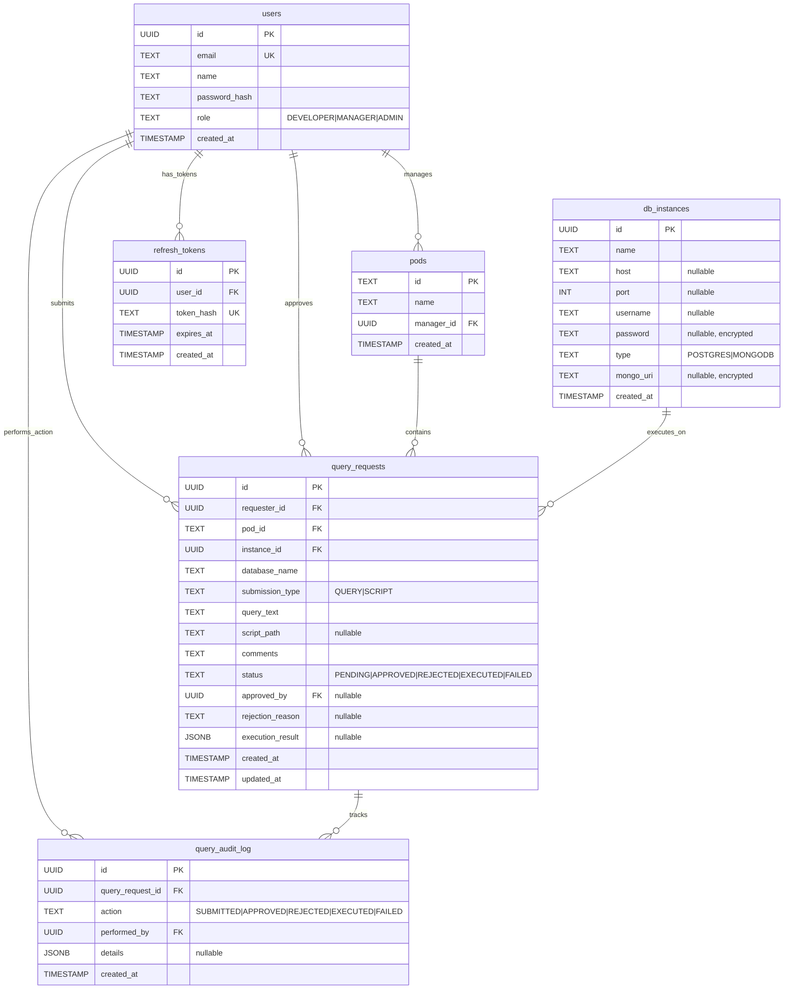

# Database ER Diagram - Zluri SRE Portal

## Entity Relationship Diagram



## Table Descriptions

### **users**
- **Purpose**: Stores all system users (developers, managers, admins)
- **Key Features**: 
  - Role-based access control
  - Encrypted password storage
  - Unique email constraint

### **pods**
- **Purpose**: Organizational units managed by managers
- **Key Features**:
  - Each pod has exactly one manager
  - Managers can manage multiple pods
  - Used for query approval routing

### **db_instances**
- **Purpose**: Database connection configurations
- **Key Features**:
  - Supports both PostgreSQL and MongoDB
  - Encrypted credentials (password, mongo_uri)
  - Flexible schema (nullable fields for different DB types)

### **query_requests**
- **Purpose**: Core entity tracking query/script execution requests
- **Key Features**:
  - Supports both SQL queries and script files
  - Complete lifecycle tracking (PENDING → EXECUTED/REJECTED/FAILED)
  - Stores execution results as JSONB
  - Links to requester, approver, pod, and target database

### **query_audit_log**
- **Purpose**: Comprehensive audit trail for all query activities
- **Key Features**:
  - Immutable log of all actions
  - Links to users who performed actions
  - Flexible details storage via JSONB
  - Indexed for performance

### **refresh_tokens**
- **Purpose**: JWT refresh token management
- **Key Features**:
  - Hashed token storage (security)
  - Automatic expiry (7 days)
  - User-based cleanup on logout

## Key Relationships

1. **User → Pod**: One-to-many (manager manages multiple pods)
2. **User → Query**: One-to-many (user submits multiple queries)
3. **Pod → Query**: One-to-many (pod contains multiple queries)
4. **DB Instance → Query**: One-to-many (instance executes multiple queries)
5. **Query → Audit Log**: One-to-many (query has multiple audit entries)
6. **User → Refresh Token**: One-to-many (user has multiple active tokens)

## Security Features

- **Encrypted Fields**: `db_instances.password`, `db_instances.mongo_uri`
- **Hashed Tokens**: `refresh_tokens.token_hash`
- **Password Hashing**: `users.password_hash` (bcrypt)
- **Role-Based Access**: `users.role` with enum constraints
- **Audit Trail**: Complete action logging in `query_audit_log`

## Indexes

```sql
-- Performance indexes
CREATE INDEX idx_audit_log_query_id ON query_audit_log(query_request_id);
CREATE INDEX idx_audit_log_action ON query_audit_log(action);
CREATE INDEX idx_audit_log_created_at ON query_audit_log(created_at);
CREATE INDEX idx_refresh_tokens_user_id ON refresh_tokens(user_id);
CREATE INDEX idx_refresh_tokens_expires_at ON refresh_tokens(expires_at);
```

## Data Flow

1. **User Registration/Login** → `users` + `refresh_tokens`
2. **Query Submission** → `query_requests` + `query_audit_log`
3. **Manager Approval** → Update `query_requests` + `query_audit_log`
4. **Query Execution** → Update `query_requests.execution_result` + `query_audit_log`
5. **Audit Review** → Query `query_audit_log` with joins to `users`

This schema supports a complete query approval workflow with comprehensive auditing and security features.