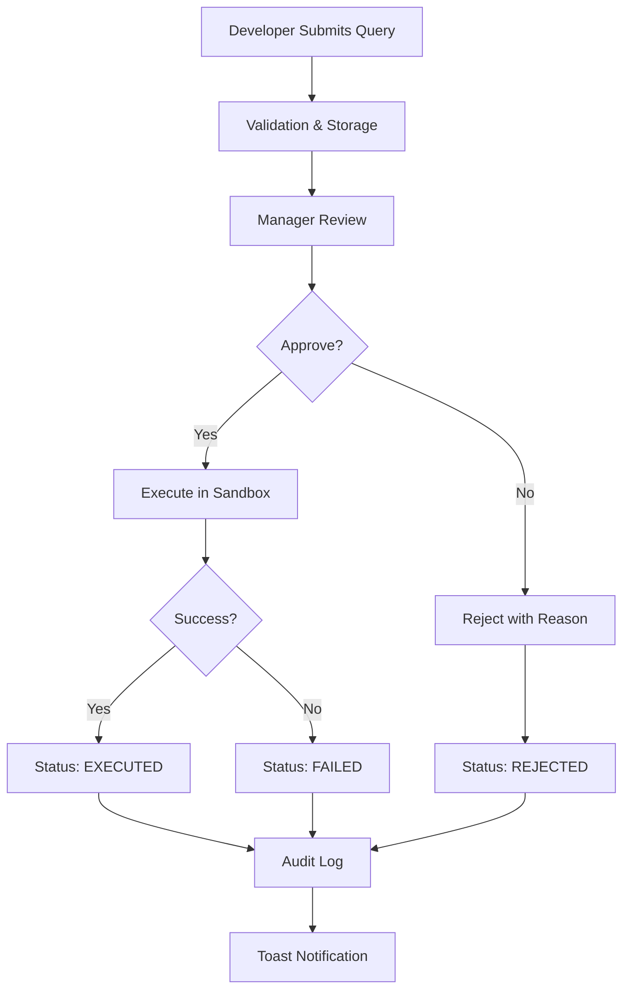

# Database Query Portal

A secure, modern web portal for developers to submit database queries and scripts for execution against production databases, with a comprehensive manager approval workflow.

## 🚀 Overview

The Database Query Portal provides a secure way for development teams to execute queries and scripts against production databases while maintaining proper oversight and audit trails. The system enforces a manager approval workflow, ensuring all database operations are reviewed before execution.

## ✨ Key Features

### 🔒 Security First
- **JWT Authentication** with refresh token rotation
- **Role-Based Access Control** (Developer, Manager, Admin)
- **Sandboxed Script Execution** in isolated child processes
- **Input Validation** with DoS protection and size limits
- **Credential Encryption** using AES-256-GCM
- **Single Statement Validation** prevents SQL injection risks

### 🎯 User Experience
- **Toast Notifications** with elegant slide-in animations
- **Dark Mode Support** with seamless theme switching
- **Responsive Design** optimized for all devices
- **Real-time Updates** with live status tracking
- **Professional Filtering** with status counters and pagination

### 📊 Management & Oversight
- **Approval Dashboard** for managers with one-click approve/reject
- **Complete Audit Trail** with detailed action logging
- **Query History** with advanced filtering and search
- **Result Visualization** with rich formatting and export options
- **POD-based Authorization** ensuring proper access control

### 🛠 Technical Excellence
- **Multi-Database Support** (PostgreSQL, MongoDB)
- **Comprehensive Validation** with clear error messages
- **File Upload Security** with type and size validation
- **Performance Optimized** with efficient queries and caching
- **100% Test Coverage** ensuring reliability

## 🏗 Architecture

```
┌─────────────────┐    ┌─────────────────┐    ┌─────────────────┐
│   Frontend      │    │    Backend      │    │   Databases     │
│   (React)       │    │   (Node.js)     │    │                 │
├─────────────────┤    ├─────────────────┤    ├─────────────────┤
│ • Dashboard     │◄──►│ • REST API      │◄──►│ • PostgreSQL    │
│ • Approval UI   │    │ • JWT Auth      │    │ • MongoDB       │
│ • Toast System  │    │ • Validation    │    │ • Portal DB     │
│ • Dark Mode     │    │ • Sandboxing    │    │                 │
│ • Filtering     │    │ • Audit Logs    │    │                 │
└─────────────────┘    └─────────────────┘    └─────────────────┘
```

## 🚦 Workflow



## 📁 Project Structure

```
database-query-portal/
├── frontend/                 # React TypeScript frontend
│   ├── src/
│   │   ├── components/       # Reusable UI components
│   │   │   ├── ui/          # Toast, Modal, Button, etc.
│   │   │   └── layout/      # Header, Navigation
│   │   ├── pages/           # Main application pages
│   │   │   ├── DashboardPage.tsx
│   │   │   ├── ApprovalDashboardPage.tsx
│   │   │   ├── MySubmissionsPage.tsx
│   │   │   └── AuditPage.tsx
│   │   ├── context/         # React context providers
│   │   ├── services/        # API client and utilities
│   │   └── types/           # TypeScript definitions
│   └── tests/               # Frontend tests
├── backend/                  # Node.js TypeScript backend
│   ├── src/
│   │   ├── modules/         # Feature modules
│   │   │   ├── auth/        # Authentication
│   │   │   ├── queries/     # Query management
│   │   │   ├── audit/       # Audit logging
│   │   │   └── users/       # User management
│   │   ├── execution/       # Query/script executors
│   │   │   └── sandbox/     # Sandboxed execution
│   │   ├── middlewares/     # Express middlewares
│   │   ├── validation/      # Input validation schemas
│   │   └── utils/           # Utilities and helpers
│   ├── tests/               # Backend tests
│   └── migrations/          # Database migrations
└── docs/                    # Additional documentation
```

## 🚀 Quick Start

### Prerequisites
- Node.js 18+ and npm
- PostgreSQL 13+ (for portal database)
- Access to target PostgreSQL/MongoDB databases

### Installation

1. **Clone the repository**
   ```bash
   git clone https://github.com/himanish-zluri/Zluri-SRE-PORTAL.git
   cd Zluri-SRE-PORTAL
   ```

2. **Setup Backend**
   ```bash
   cd backend
   npm install
   cp .env.example .env
   # Edit .env with your database credentials
   
   # Run migrations
   psql -d your_database -f migrations/001_init.sql
   # ... run all migrations in order
   
   npm run dev
   ```

3. **Setup Frontend**
   ```bash
   cd frontend
   npm install
   cp .env.example .env
   # Edit .env with your API URL
   
   npm run dev
   ```

4. **Access the Application**
   - Frontend: http://localhost:5173
   - Backend API: http://localhost:3000
   - Login with seeded admin user: `admin1@zluri.com` / `password123`

## 🔧 Configuration

### Environment Variables

**Backend (.env)**
```env
PORT=3000
DB_HOST=localhost
DB_PORT=5432
DB_USER=postgres
DB_PASSWORD=your_password
DB_NAME=query_portal
JWT_SECRET=your_jwt_secret_here
ENCRYPTION_KEY=your_32_char_encryption_key_here
```

**Frontend (.env)**
```env
VITE_API_BASE_URL=http://localhost:3000/api
VITE_APP_TITLE=Database Query Portal
```

### Input Size Limits
```typescript
// Configurable in backend/src/validation/schemas/query.schema.ts
const MAX_QUERY_SIZE = 50000;      // 50KB
const MAX_SCRIPT_SIZE = 5000000;   // 5MB  
const MAX_COMMENTS_SIZE = 2000;    // 2KB
```

## 🧪 Testing

### Backend Tests
```bash
cd backend
npm test                    # Run all tests
npm run test:coverage      # With coverage report
npm run test:watch         # Watch mode
```

### Frontend Tests
```bash
cd frontend
npm test                    # Run all tests
npm run test:coverage      # With coverage report
npm test -- --watch        # Watch mode
```

**Test Coverage**: 100% branch coverage on critical paths

## 📚 API Documentation

Comprehensive API documentation is available at:
- **Backend API**: [backend/API_DOCUMENTATION.md](backend/API_DOCUMENTATION.md)
- **OpenAPI Spec**: Available at `/api/docs` when server is running

### Key Endpoints
- `POST /api/auth/login` - User authentication
- `POST /api/queries` - Submit query/script
- `POST /api/queries/:id/approve` - Approve query
- `GET /api/queries` - List queries with filtering
- `GET /api/audit` - Audit trail (admin only)

## 🔐 Security Features

### Input Validation & DoS Protection
- **Query Text**: 50KB limit prevents oversized queries
- **Script Files**: 5MB limit with content validation
- **Multiple Statement Prevention**: Single SQL/MongoDB statement enforcement
- **File Type Validation**: Only `.js` files allowed for scripts

### Authentication & Authorization
- **JWT Tokens**: Access + refresh token pattern
- **Role-Based Access**: Developer, Manager, Admin roles
- **Session Management**: Secure logout and token rotation

### Execution Security
- **Process Isolation**: Scripts run in sandboxed child processes
- **Timeout Protection**: 30-second execution limit
- **Credential Isolation**: Database credentials injected securely

## 🎨 User Interface

### Toast Notification System
- **Elegant Animations**: Slide-in from top-right corner
- **Auto-dismiss**: 3-second timer with manual close option
- **Type Support**: Success ✅, Error ❌, Warning ⚠️, Info ℹ️
- **Dark Mode**: Seamless theme integration

### Professional Filtering
- **Status Counters**: Real-time counts for all query states
- **Multi-criteria**: Filter by status, type, user, date range
- **Pagination**: Efficient handling of large datasets
- **Search**: Full-text search across query content

## 📈 Recent Updates

### v2.1.0 - Toast Notifications & UX Enhancement
- ✅ Elegant toast notification system
- ✅ Enhanced approval dashboard UX
- ✅ Improved error handling and user feedback
- ✅ Auto-dismiss and manual close options

### v2.0.0 - Security & Validation Overhaul
- ✅ Comprehensive input validation with size limits
- ✅ Multiple statement prevention for Query mode
- ✅ DoS protection with configurable limits
- ✅ Enhanced file upload security

### v1.9.0 - Professional Filtering
- ✅ Advanced filtering with status counters
- ✅ Real-time status updates
- ✅ Improved pagination and performance
- ✅ Enhanced user experience

## 🤝 Contributing

1. Fork the repository
2. Create a feature branch (`git checkout -b feature/amazing-feature`)
3. Commit your changes (`git commit -m 'Add amazing feature'`)
4. Push to the branch (`git push origin feature/amazing-feature`)
5. Open a Pull Request

### Development Guidelines
- Follow TypeScript strict mode
- Maintain 100% test coverage for critical paths
- Use conventional commit messages
- Update documentation for new features

## 📄 License

This project is licensed under the MIT License - see the [LICENSE](LICENSE) file for details.

## 🆘 Support

For support and questions:
- **Issues**: [GitHub Issues](https://github.com/himanish-zluri/Zluri-SRE-PORTAL/issues)
- **Documentation**: Check the `backend/` and `frontend/` README files
- **API Docs**: [backend/API_DOCUMENTATION.md](backend/API_DOCUMENTATION.md)

## 🙏 Acknowledgments

- Built with modern web technologies (React, Node.js, TypeScript)
- Inspired by enterprise database management needs
- Designed for security, usability, and maintainability

---

**Database Query Portal** - Secure, Modern, Professional Database Query Management