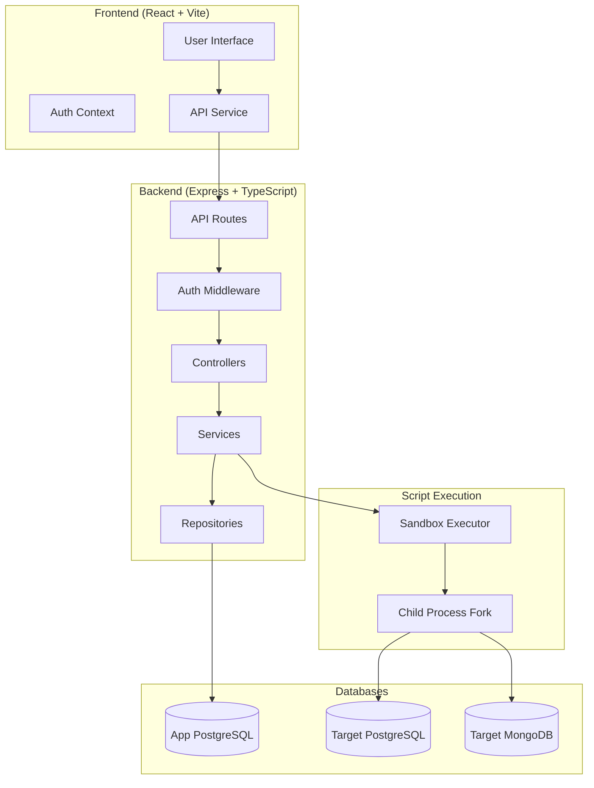
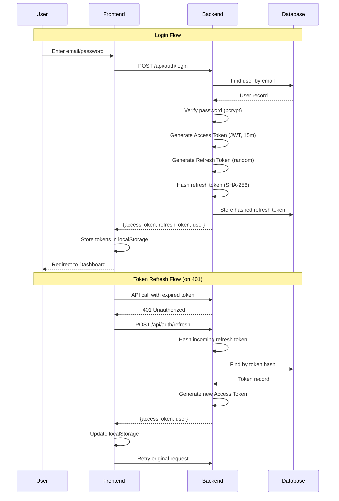
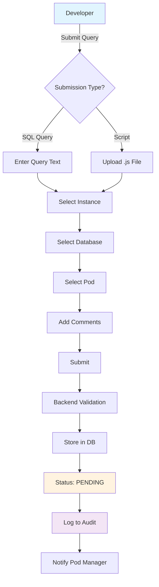
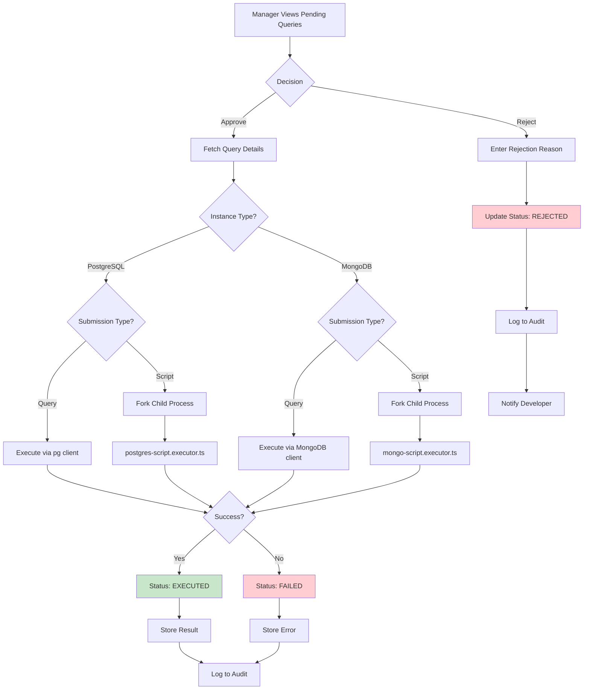
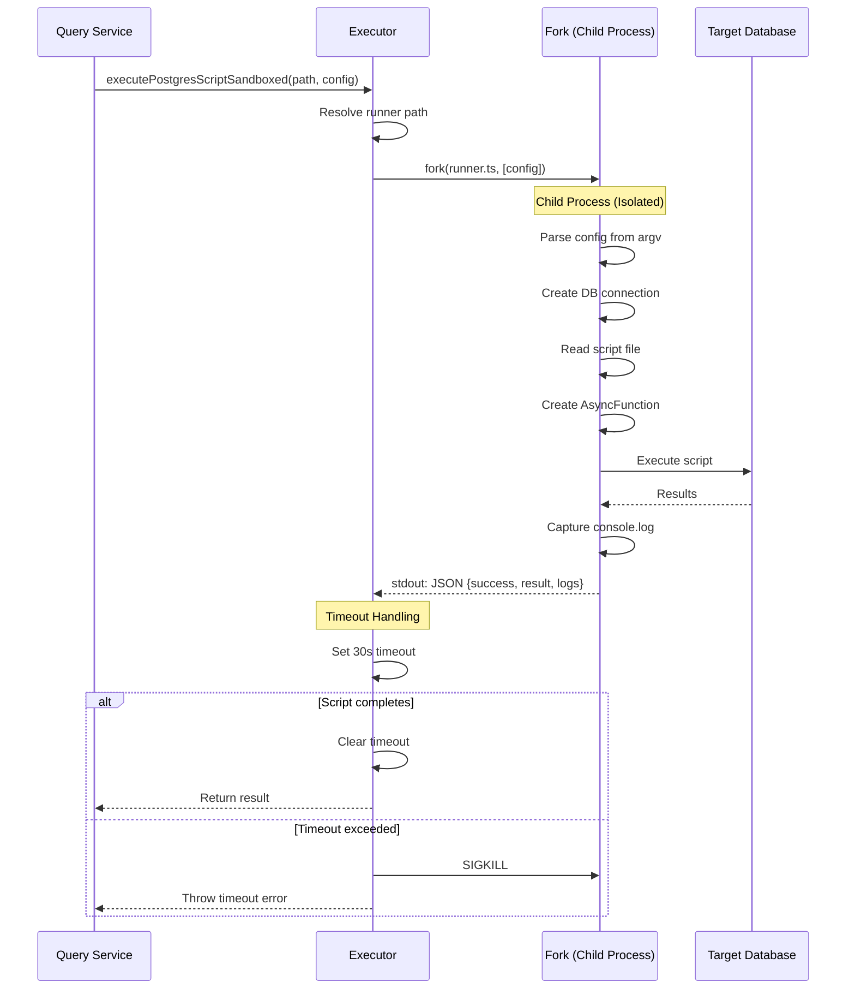
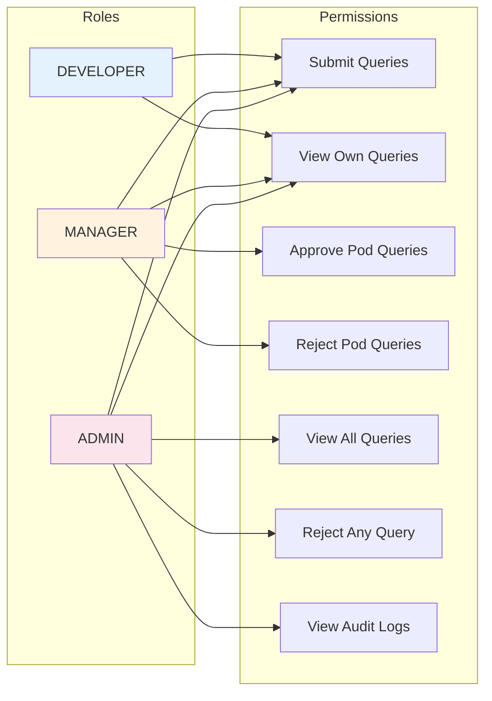
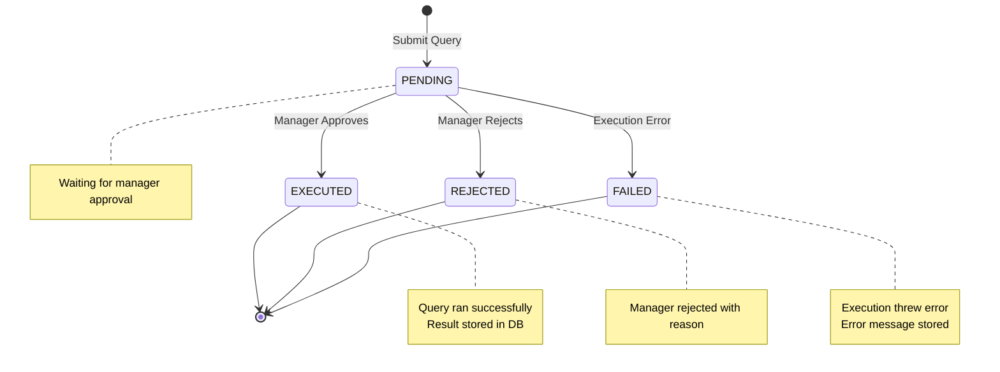
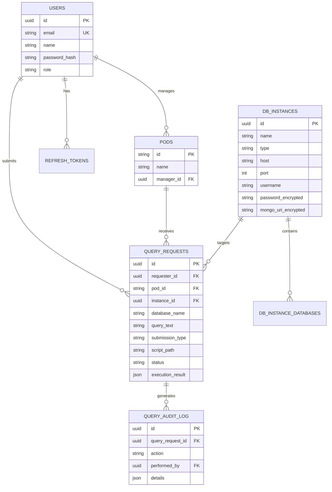
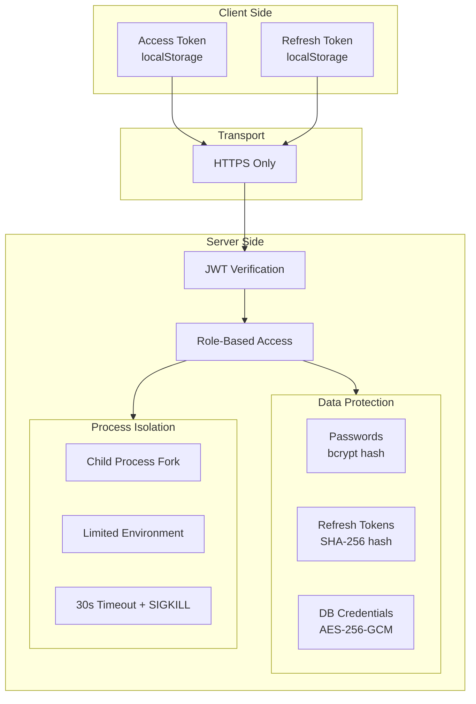
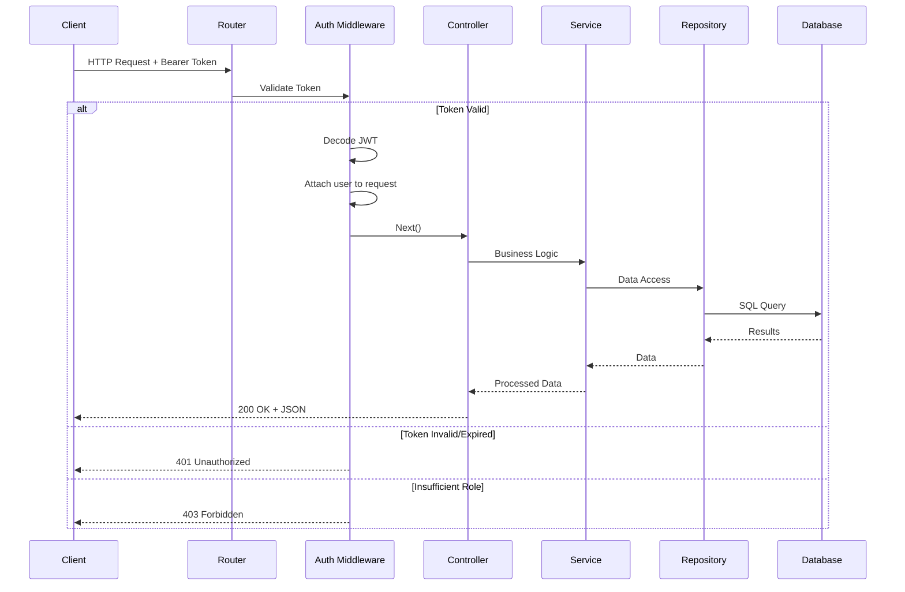

# SRE Portal - Workflow Diagrams

## 1. High-Level System Architecture

---

## 2. Authentication Flow

---

## 3. Query Submission Workflow

---

## 4. Query Approval/Execution Workflow

---

## 5. Script Sandbox Execution Flow

---

## 6. Role-Based Access Control

---

## 7. Data Flow - Query Lifecycle

---

## 8. Database Schema Relationships

---

## 9. Security Architecture

---

## 10. API Request Flow

---

## How to Use in Notion

1. Create a new Notion page
2. Type `/code` and select "Code" block
3. Set language to "Mermaid"
4. Paste each diagram code
5. Notion will render the diagram automatically

Alternatively, use Notion's built-in diagram tools or embed from Mermaid Live Editor (https://mermaid.live)
